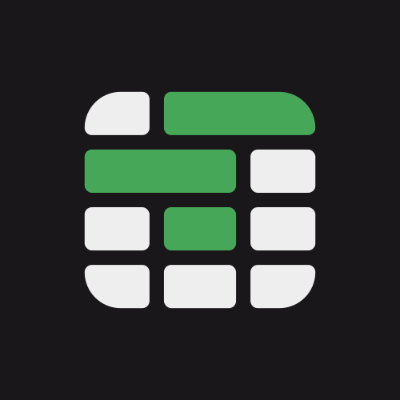
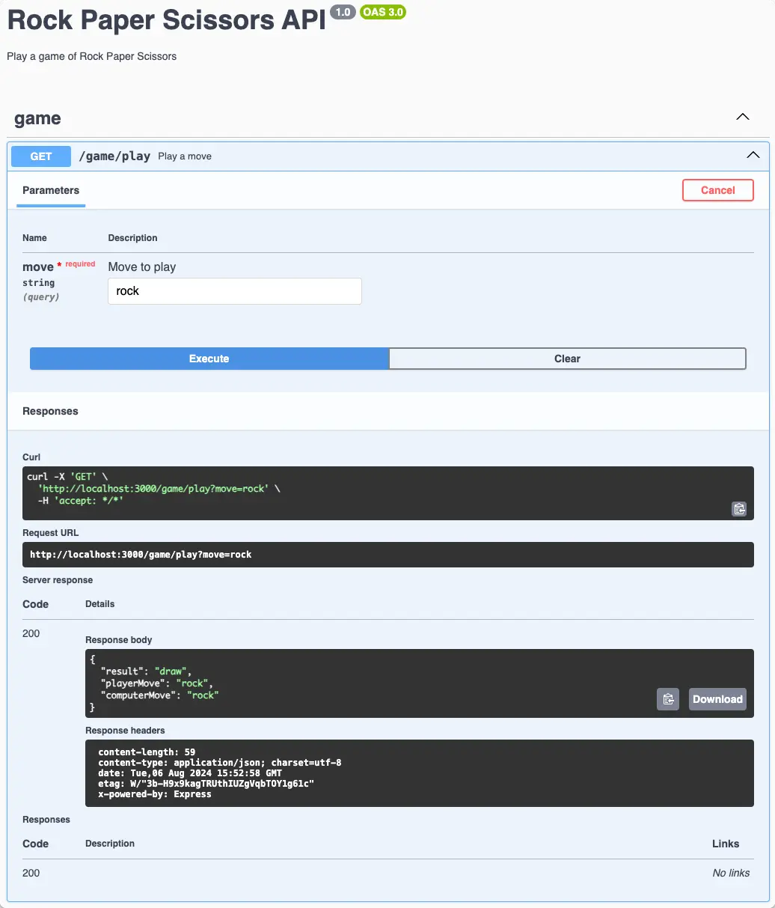

<p align="center">
  <a href="http://nestjs.com/" target="blank"></a>
</p>

<p align="center">A sample TypeScript application demo for building and deploying to Fly.io using the <a href="https://depot.dev/blog/fly-builds-powered-by-depot">built-in Depot builder</a> for accelerated deployments.</p>


## Description

This sample API is built using [Nest](https://docs.nestjs.com/) framework with [Swagger](https://swagger.io/) for API documentation. The application is built using TypeScript and demonstrates how to deploy to Fly.io using the [built-in Depot builder](https://depot.dev/blog/fly-builds-powered-by-depot) for accelerated deployments.

View the full walkthrough on the [Depot blog]() **coming soon**.

## Installation

```bash
$ pnpm install
```

## Running the app

```bash
# development
$ pnpm run start

# watch mode
$ pnpm run start:dev
```

The server will be running at [http://localhost:3000](http://localhost:3000)

**Swagger API Documentation**

Visit [http://localhost:3000/api](http://localhost:3000/api) to view the Swagger API documentation.

[](./.github/img/swagger-rock-paper-scissors.webp)

**Play Game**

To play Rock, Paper, Scissors, make a `GET` request to `/game/play` endpoint with the `move` query parameter. The `move` query parameter should be one of `rock`, `paper`, or `scissors`.

Example: [http://localhost:3000/game/play?move=rock](http://localhost:3000/game/play?move=rock)

## Deploying to Fly.io

Fly.io now supports deploying applications using the [built-in Depot builder](https://depot.dev/blog/fly-builds-powered-by-depot) for accelerated deployments. Use the included Dockerfile to deploy your application to Fly.io, using the `--depot` flag to enable the Depot builder.

```bash
$ fly deploy --depot
```
